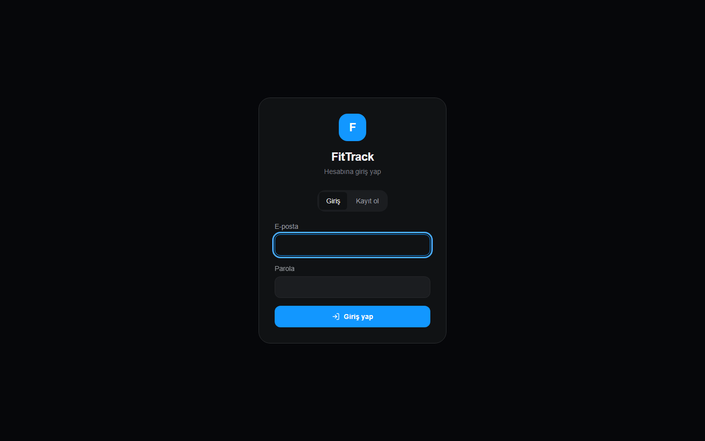
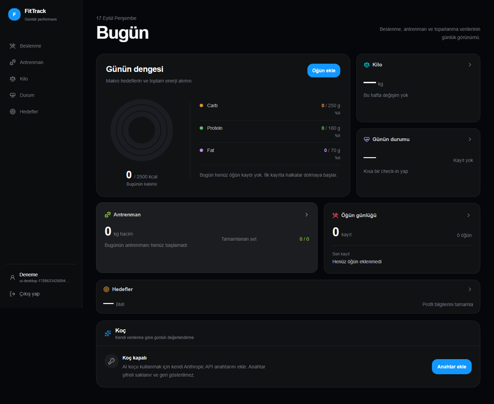
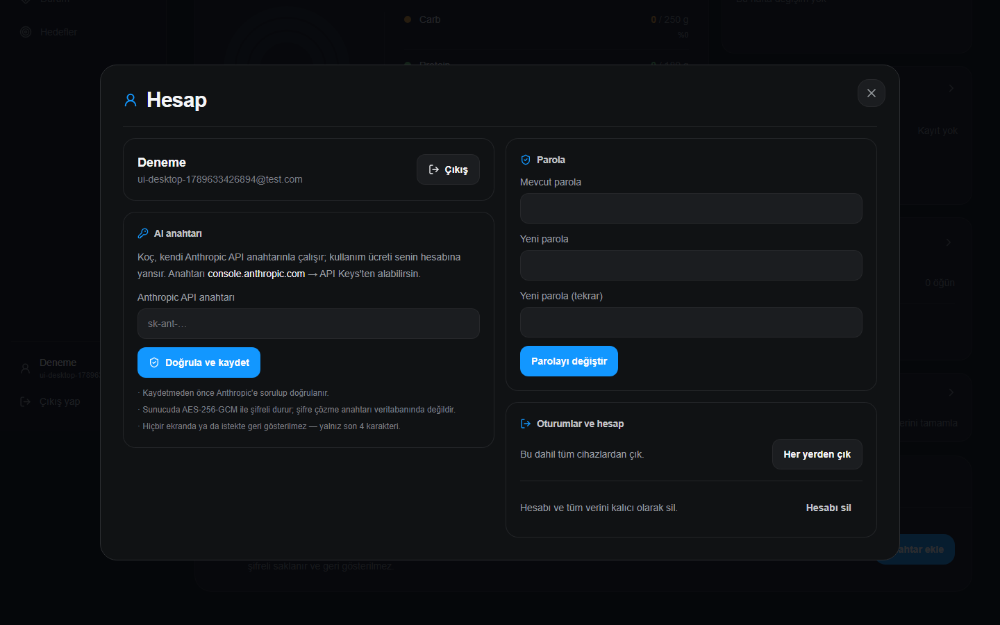
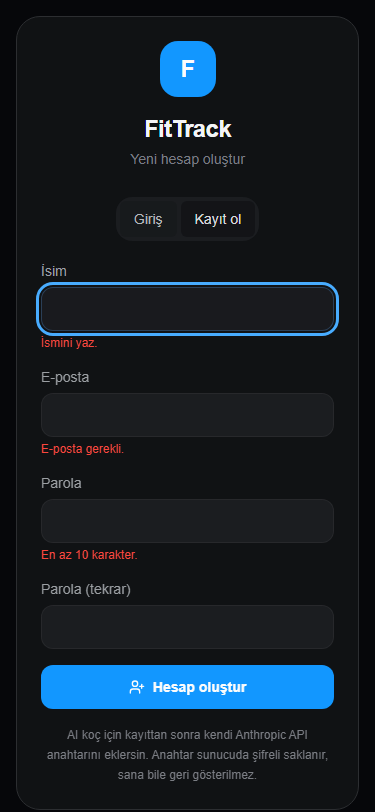
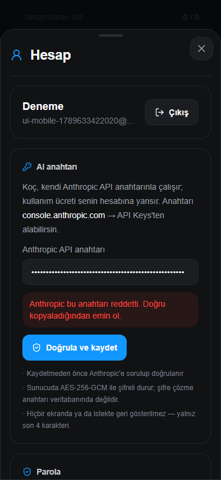

# Çok kullanıcılı geçiş ve AI anahtarı koruması — rapor

**Tarih:** 2026-09-17 · **Kapsam:** `FitTrack.API`, `fittrack-client`, yeni `FitTrack.Tests`
**Sonuç:** 94/94 test geçti · satır kapsamı **%93,9** · dal kapsamı **%79,7** ([ayrıntı](coverage/SummaryGithub.md))

---

## 1. Ne değişti

FitTrack tek parolayla korunan tek kişilik bir uygulamaydı. Artık:

1. **Herkes hesap açar** (e-posta + parola). Her hesabın verisi yalnız kendisine görünür.
2. **AI koçu yalnız kendi Anthropic anahtarını ekleyen kullanır.** Sunucuda paylaşılan anahtar yok;
   anahtarı olmayanın koç kartı kapalıdır, uç `403 ai_key_missing` döner.
3. **Anahtarlar şifreli saklanır, hiçbir yerde geri gösterilmez.** Hesap → "AI anahtarı" bölümünden
   eklenir, değiştirilir, silinir.
4. **Telegram hesap başına bağlanır** (web'den tek kullanımlık kod → bota `/link KOD`).
5. **Eski tek kullanıcılı veri kaybolmadı:** göçte sahipsiz işaretlenir, yalnız eski uygulama
   parolasını bilen hesap sahiplenebilir.

| Önce | Sonra |
|---|---|
| `X-Api-Key` başlığı, parola `localStorage`'da | HttpOnly + SameSite=Strict oturum çerezi, JS hiçbir sır görmez |
| Tek `ANTHROPIC_API_KEY` ortam değişkeni | Kullanıcı başına AES-256-GCM ile şifreli anahtar |
| Telegram: ilk yazan sohbet sahiplenir | Kodla bağlanan sohbet, bir sohbet = bir hesap |
| `MealEntries`/`WeightLogs`/`WorkoutSessions` genel CRUD uçları (kullanılmıyordu, tüm alanları istemciden alıyordu) | **Kaldırıldı** |
| CORS + `ALLOWED_ORIGINS` | Kaldırıldı — arayüz ve API aynı origin, CORS'a gerek yok |



---

## 2. Tehdit modeli → kontrol → kanıt

Her satırdaki kontrol bir testle doğrulanıyor. Test adları `FitTrack.Tests` altındadır.

| # | Tehdit | Kontrol | Test |
|---|---|---|---|
| T1 | Kullanıcı B, A'nın kaydını ID ile okur/değiştirir/siler | EF Core **global sorgu filtresi** (her `IUserOwned` tablo) + `SaveChanges` sahiplik kalkanı; ihlal 404 | `IsolationTests.*` (öğün, antrenman ağacı, kilo, check-in, hedef, profil) |
| T2 | Controller'da unutulmuş bir filtre | Kural controller'da değil **DbContext'te**; kimliksiz bağlam hiçbir satır görmez, hiçbir satır yazamaz | `OwnershipGuardTests.Anonymous_context_cannot_write_or_read_owned_rows` |
| T3 | İstek gövdesine `userId` koyarak başkası adına yazma | `UserId` `[JsonIgnore]`; eklemede oturumdaki kullanıcıya damgalanır, yabancı değer istisna | `IsolationTests.UserId_in_request_body_is_ignored`, `OwnershipGuardTests.Insert_is_stamped_and_foreign_owner_rejected` |
| T4 | Başkasının seansına hareket/set ekleme | Alt kayıt eklenirken üst kaydın sahipliği kanıtlanır | `IsolationTests.Workout_graph_is_private`, `OwnershipGuardTests.Child_rows_require_owned_parent` |
| T5 | Model (LLM) başka kullanıcının kayıt ID'sini "uydurur" | Koç araçları aynı filtreli bağlamda çalışır | `CoachToolTests.Meal_tools_are_scoped`, `CoachTests.Tool_cannot_delete_another_users_meal_by_id` |
| T6 | Veritabanı / yedek sızar → anahtarlar okunur | AES-256-GCM; ana anahtar **volume'da değil** `FITTRACK_ENCRYPTION_KEY` ortam değişkeninde | `ApiKeyTests.Valid_key_is_encrypted_at_rest_and_never_returned` (DB dosyasında düz metin taranır) |
| T7 | DB'ye yazabilen saldırgan A'nın şifreli anahtarını B'nin satırına kopyalar | Kullanıcı ID'si GCM'e **AAD** olarak bağlı → çözme başarısız, Anthropic'e çağrı yapılmaz | `ApiKeyTests.Ciphertext_copied_to_another_user_cannot_be_used`, `KeyProtectorTests.Bound_to_user_id` |
| T8 | Anahtar bir API cevabında / arayüzde geri görünür | Hiçbir uç anahtarı döndürmez; yalnız `sk-ant-…abcd` ipucu | `ApiKeyTests.Valid_key_is_encrypted_at_rest_and_never_returned` |
| T9 | Şifreli metin kurcalanır | GCM etiketi; bozuk/eksik/yanlış sürüm reddedilir | `KeyProtectorTests.Rejects_tampering_and_bad_base64`, `Rejects_malformed` |
| T10 | Üretimde ana anahtar unutulur, anahtarlar düz saklanır | **Fail-closed:** anahtar saklama ve kullanma tamamen kapanır (`503`) | `NoEncryptionKeyTests.Key_storage_is_disabled_in_production_without_master_key` |
| T11 | Geçersiz anahtar kaydedilir, koç sessizce ölür | Kaydetmeden önce Anthropic `GET /v1/models` ile doğrulanır; ağ hatasında **kaydedilmez** | `ApiKeyTests.Key_rejected_by_anthropic_is_not_stored`, `Unreachable_anthropic_does_not_store_key` |
| T12 | Parola sızıntısı | PBKDF2 (ASP.NET Identity `PasswordHasher` v3); min 10 karakter, e-postayla aynı olamaz | `AuthTests.Password_is_hashed_not_stored`, `Register_validates_input` |
| T13 | Parola kaba kuvvet | Hesap başına 5 hata → 15 dk kilit; IP başına dakikada 10 giriş/kayıt | `AuthTests.Account_locks_after_five_failures_even_for_correct_password`, `RateLimitTests.*` |
| T14 | Cevap süresinden "bu e-posta kayıtlı mı" okumak | Olmayan hesapta da sahte PBKDF2 doğrulaması | (kod incelemesi — zamanlama testi güvenilir değil) |
| T15 | XSS ile oturum çalma | Çerez `HttpOnly`; CSP `script-src 'self'`; `localStorage`'da sır yok | `AuthTests.Session_cookie_is_httponly_and_strict`, `Security_headers_present` |
| T16 | CSRF | `SameSite=Strict` + yazan her `/api` isteğinde zorunlu `X-Requested-With: FitTrack` başlığı | `AuthTests.State_changing_requests_require_csrf_header` |
| T17 | Çalınmış/eski oturum parola değişince de çalışmaya devam eder | Çerezde oturum sürümü; her istekte DB ile karşılaştırılır. Parola değişimi, "her yerden çık", hesap silme hepsini anında düşürür | `AuthTests.Password_change_revokes_other_sessions_and_keeps_current`, `Logout_all_revokes_every_session` |
| T18 | Üretimde çerez HTTP'den sızar / alt alan adından enjekte edilir | `__Host-` öneki, `Secure`, `Path=/`, `Domain` yok; HSTS | `NoEncryptionKeyTests.Production_cookie_uses_host_prefix_and_secure_and_hsts` |
| T19 | İlk kayıt olan yabancı eski veriyi sahiplenir | Sahiplenme eski `FITTRACK_API_KEY` parolasını ister (sabit süreli karşılaştırma, sunucu genelinde saatte 20 deneme) | `LegacyMigrationTests.Migration_claim_flow` |
| T20 | Telegram'da yabancı sohbet veriye erişir | Bağlı olmayan sohbet hiçbir sorgu çalıştıramaz; grup sohbeti reddedilir | `TelegramTests.Unlinked_chat_gets_instructions_and_touches_nothing`, `Group_chats_are_refused` |
| T21 | Bağlama kodu tahmini / tekrar kullanımı | 8 karakter (32⁸), 10 dk ömür, **tek kullanımlık**, DB'de yalnız SHA-256 özeti, sohbet başına 15 dk'da 5 deneme | `TelegramTests.Link_flow_single_use_code`, `Expired_code_is_rejected`, `Brute_force_is_limited_per_chat` |
| T22 | Telegram mesajı başkasının anahtarıyla faturalanır | Mesaj, sohbetin sahibinin kapsamında ve anahtarıyla işlenir | `TelegramTests.Linked_chat_uses_only_its_owners_key_and_data` |
| T23 | Gece özeti yanlış kullanıcıya gider / veri yazar | Her hesap ayrı kapsamda; özet **salt-okunur** araç setiyle çağrılır (yazan araçlar modele hiç verilmez) | `TelegramTests.Daily_nudge_and_summary_are_per_user` |
| T24 | Kullanıcı adıyla sistem promptuna talimat sokmak | İsimden kontrol karakterleri (satır sonu) atılır, uzunluk sınırlı | `CoachToolTests.Notes_are_scoped_and_display_name_is_sanitized` |
| T25 | İstemciden `system` rolü ya da sondaki `assistant` turu (prefill) sokmak | Yalnız `user`/`assistant` geçer, sondaki `assistant` atılır; mesaj sayısı ve uzunluğu sınırlı | `CoachTests.Chat_input_is_bounded_and_sanitized` |
| T26 | Hata ayrıntısı sızar | Genel hata işleyici; Anthropic hata gövdesi istemciye dönmez | `CoachTests.Anthropic_failure_returns_502_without_details` |
| T27 | Hesap silinince veri kalır | Parola onayıyla tüm tablolardan kullanıcı satırları + anahtar + hesap tek transaction'da silinir | `AuthTests.Delete_account_requires_password_and_removes_everything` |

---

## 3. Anahtar koruması — nasıl çalışıyor

```
Kullanıcı anahtarı girer (HTTPS, type=password, autocomplete=off)
  → PUT /api/account/ai-key   [oturum + CSRF başlığı + 10 dk'da 10 deneme]
  → biçim kontrolü (20–256 yazdırılabilir ASCII, boşluk yok)
  → Anthropic GET /v1/models ile canlı doğrulama (token harcamaz)
  → AES-256-GCM( anahtar, nonce=rastgele 12 bayt, AAD=kullanıcı ID )
  → DB: "v1:<ana-anahtar-kimliği>:<base64(nonce|tag|şifreli)>" + ipucu "sk-ant-…abcd"
  → form alanı temizlenir; cevapta yalnız ipucu

Koç çağrısı:
  → oturumdaki kullanıcının satırı okunur → bellekte çözülür → x-api-key başlığına konur
  → çözme başarısızsa (ana anahtar değişmiş, kurcalanmış, kopyalanmış) Anthropic'e hiç gidilmez
```

**Ana anahtar döndürme:** yeni anahtarı `FITTRACK_ENCRYPTION_KEY`'e, eskisini
`FITTRACK_ENCRYPTION_KEY_PREVIOUS`'a koy. Eski kayıtlar okunur ve ilk kullanımda yeni anahtarla
yeniden yazılır (`KeyProtectorTests.Rotation_reads_previous_and_requests_rewrap`).

**Ana anahtar kaybolursa:** kayıtlı anahtarlar çözülemez; kullanıcılar anahtarlarını yeniden girer.
Başka veri etkilenmez. Bu yüzden anahtar Railway değişkeninde **ve** bir parola yöneticisinde durmalı.





| Mobil — kayıt doğrulaması | Mobil — Anthropic anahtarı reddetti |
|---|---|
|  |  |

---

## 4. Canlıya alma adımları (sıra önemli)

> Repo'ya push, Railway'de otomatik deploy tetikler.

1. **Ana anahtarı üret ve Railway'e ekle** (deploy'dan önce ya da hemen sonra):
   ```powershell
   [Convert]::ToBase64String((1..32 | % { [byte](Get-Random -Max 256) }))
   ```
   Railway → Variables → `FITTRACK_ENCRYPTION_KEY`. Bir kopyasını parola yöneticisine koy.
   Yoksa uygulama çalışır ama AI anahtarı saklama kapalıdır (fail-closed).
2. `FITTRACK_API_KEY`'i **silme** — eski veriyi sahiplenmek için gerekiyor. Sahiplendikten sonra silinebilir.
3. `ANTHROPIC_API_KEY` artık **okunmuyor**. Silinebilir.
4. `ALLOWED_ORIGINS` artık okunmuyor. Silinebilir.
5. Deploy bitince: uygulamayı aç → **Kayıt ol** → Hesap → **Eski verileri sahiplen** (eski parola) →
   **AI anahtarı** ekle. Telegram sohbeti de sahiplenmeyle bu hesaba taşınır.

Göç (`SchemaUpgrade`) açılışta kendiliğinden ve idempotent çalışır: yeni tablolar, her kullanıcı
tablosuna `UserId` kolonu + indeks. Mevcut satır silinmez veya değiştirilmez.
Doğrulama: canlı veritabanının yerel kopyası üzerinde container'da çalıştırıldı, veri kaybı yok,
sahiplenme sonrası sahipsiz satır 0 (`LegacyMigrationTests` aynı şemayla da doğruluyor).

---

## 5. Testler

```powershell
docker build -f Dockerfile.test -t fittrack-tests .
docker run --rm -v "${PWD}/docs/reports/coverage:/out" fittrack-tests
```

Testler Windows'ta değil Linux container'da koşar — Smart App Control yeni derlenen DLL'leri
rastgele engelliyor (README → GOTCHAS).

| Sınıf | Ne sınıyor | Test |
|---|---|---|
| `AuthTests` | kayıt, giriş, kilit, CSRF, oturum iptali, hesap silme, güvenlik başlıkları | 22 |
| `RateLimitTests` | IP başına giriş sınırı | 1 |
| `IsolationTests` | tüm veri alanlarında kullanıcılar arası izolasyon | 6 |
| `ApiKeyTests`, `NoEncryptionKeyTests` | anahtar doğrulama, şifreleme, kopyalama saldırısı, fail-closed, üretim çerezi | 11 |
| `CoachTests` | anahtar kapısı, kullanıcı başına faturalama, araç yazma izolasyonu, iptal edilmiş anahtar, girdi sınırları | 7 |
| `CoachToolTests` | her koç aracının kapsamı, not/prompt izolasyonu, isim temizleme | 3 |
| `TelegramTests` | bağlama akışı, kod güvenliği, sohbet sahipliği, gece koçu | 11 |
| `LegacyMigrationTests` | canlı şemadan göç + sahiplenme | 1 |
| `KeyProtectorTests`, `ValidationTests`, `OwnershipGuardTests` | birim: şifreleme, doğrulayıcılar, DbContext kalkanı | 32 |
| **Toplam** | | **94** |

Sahte dış servisler: Anthropic ve Telegram API'leri `FakeAnthropic` üzerinden geçer; testler ağa çıkmaz.
Testler gerçek `Program.cs`'i, tüm middleware'i ve gerçek SQLite dosyasını kullanır.

### Kapsam (satır / dal)

| Katman | Satır | Dal |
|---|---|---|
| `AppDbContext` (sahiplik kalkanı) | 100% | 95,2% |
| `SchemaUpgrade` (göç) | 100% | 100% |
| `AccountController` | 100% | 79,1% |
| `AuthController` | 96,6% | 86,6% |
| `CoachController` | 100% | 94,1% |
| `CoachService` | 95,8% | 82,6% |
| `ApiKeyService` | 94,4% | 73% |
| `KeyProtector` | 84,7% | 89,2% |
| `CsrfHeaderMiddleware`, `SecurityHeadersMiddleware`, `SessionValidation` | 100% | 100% / 100% / 70% |
| `TelegramBotService` | 68,1% | 53,7% |
| `DailyCoachService` | 75% | 52,6% |
| **Toplam** | **93,9%** | **79,7%** |

**Kapsanmayanlar ve nedeni:**
- `TelegramBotService.ExecuteAsync` / `DailyCoachService.ExecuteAsync` — uzun yoklama ve zamanlayıcı
  döngüleri. İçlerinden çağrılan güvenlik mantığı (`HandleUpdate`, `LinkAsync`, `TryNudgeAsync`,
  `TrySummaryAsync`) test ediliyor; döngünün kendisi (409 çakışması, yeniden deneme) edilmiyor.
- `KeyProtector.DevKey` — yalnız Development'ta ana anahtar verilmediğinde kullanılan yerel anahtar dosyası.
- `WeightPoint`, `ExerciseHistoryItem` %0 görünür: SQL'e çevrilen projeksiyonlar, coverlet göremez; uçları testli.
- Kestrel'in 1 MB gövde sınırı: test sunucusu Kestrel'i kullanmadığı için sınanmadı (uygulama katmanındaki mesaj sınırı sınandı).
- **Arayüz** (`fittrack-client`) birim testi yok. Uçtan uca doğrulama headless Chromium ile yapıldı
  (375 px ve 1440 px): giriş hatası, kayıt doğrulaması, kayıt → koç kapalı kartı → hesap ekranı →
  Anthropic reddi. Konsolda beklenen 401/400 dışında hata yok, yatay taşma yok.

### Yolda bulunan hata
Arayüz testi gerçek bir hata yakaladı: girişten sonra `queryClient.clear()` oturum sorgusunu da
önbellekten siliyor, `useSession` gözlemcisi silinen sorguya bağlı kaldığı için kayıt sunucuda
başarılı olsa da ekran giriş formunda kalıyordu. Düzeltildi (README → GOTCHAS).

---

## 6. Bilinen sınırlar (bilinçli olarak kapsam dışı)

- **E-posta doğrulaması ve parola sıfırlama yok.** E-posta servisi yok; parolasını unutan hesabına
  erişemez. Açık kayıt olduğu için sahte e-postayla hesap açılabilir (yalnız kendi boş verisini görür).
- **Kayıt uç noktası e-postanın kayıtlı olduğunu söyler** (`409`). Kayıt akışında bunu gizlemek
  e-posta doğrulaması gerektirir.
- **Kayıt açık.** Kapatmak/davetiye istemek gerekirse ayrı iş.
- IP sınırı Railway'in `X-Forwarded-For` başlığına güvenir (`ForwardLimit=1`). Uygulama doğrudan
  (proxy'siz) internete açılırsa bu ayar gözden geçirilmeli.
- Telegram bağlama deneme sayacı bellekte; yeniden başlatmada sıfırlanır (kod zaten 10 dk ömürlü ve tek kullanımlık).
